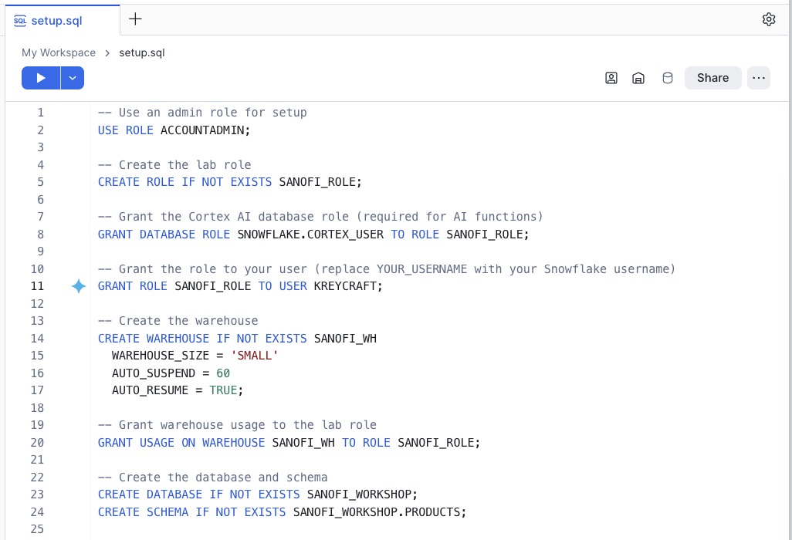
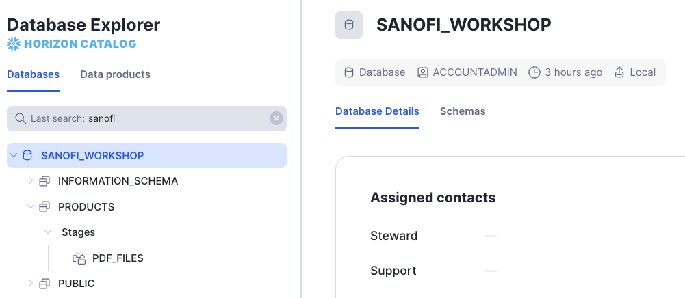
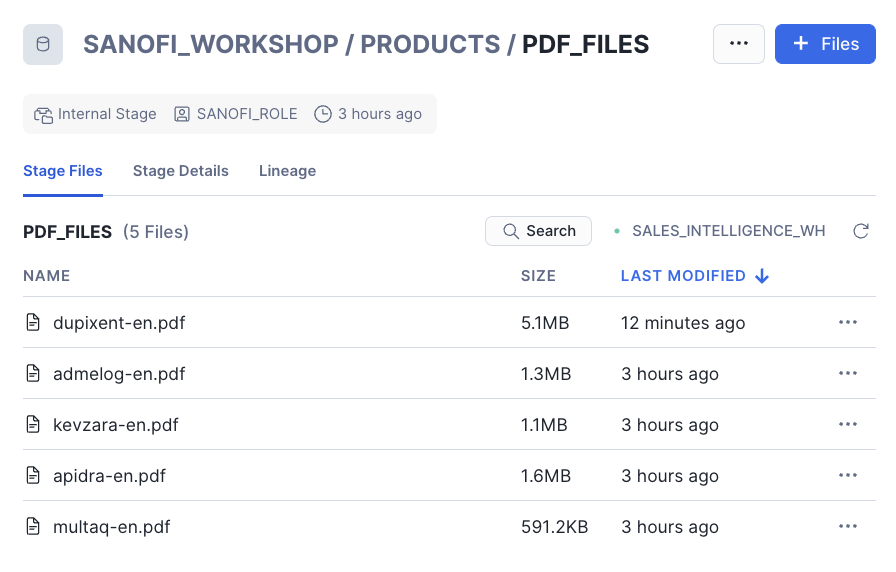
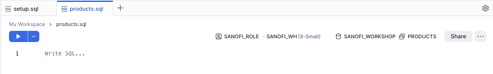
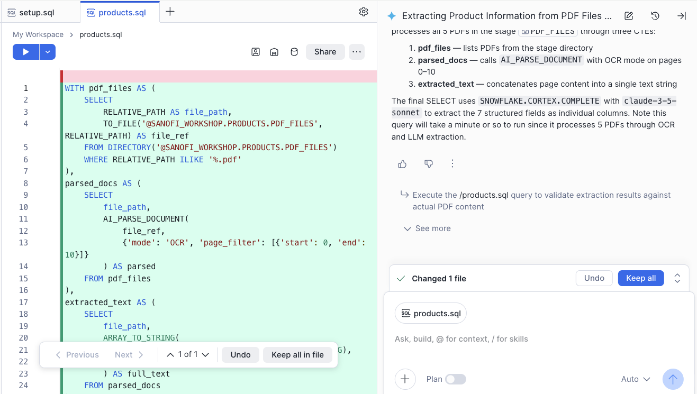
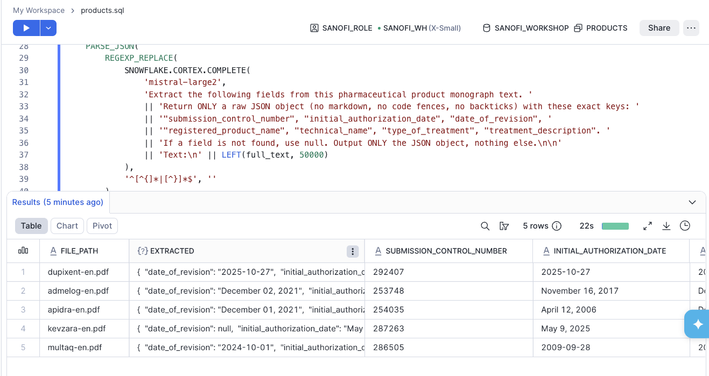

# Extracting Structured Data from Product Monographs Using Snowflake Cortex AI

## Overview

Pharmaceutical companies manage large volumes of regulatory documents such as Product Monographs. Extracting key information — product names, authorization dates, submission control numbers, and therapeutic indications — from these multi-page PDF documents is traditionally a manual, time-consuming process.

In this hands-on lab, you will use **Snowflake Cortex AI functions** to automatically extract structured data from 5 Sanofi Product Monograph PDFs, all from within the Snowflake platform. You will use **Cortex Code** — Snowflake's AI-powered assistant available in Snowsight Workspaces — to help you write SQL that calls these AI functions.

### What You'll Learn

- How to upload PDF files to a Snowflake internal stage
- How to use **AI_PARSE_DOCUMENT** to extract text and layout from PDF documents
- How to use **SNOWFLAKE.CORTEX.COMPLETE** (a large language model) to extract structured fields from unstructured text
- How to combine multiple Cortex AI functions in a single SQL pipeline
- How to use **Cortex Code** in Snowsight Workspaces to generate SQL

### What You'll Build

A SQL query that processes 5 Product Monograph PDFs and returns a structured table with the following columns:

| Column | Description |
|---|---|
| Submission Control Number | The Health Canada submission control number |
| Initial Authorization Date | When the product was first authorized |
| Date of Revision | Most recent revision date of the monograph |
| Product Name | The registered brand name |
| Technical Name | The generic/proper name of the drug |
| Type of Treatment | The drug class (e.g., insulin, immunomodulator) |
| Treatment Description | Main therapeutic indications |

### Cortex AI Functions Used

This lab showcases three Snowflake Cortex AI functions working together:

1. **AI_PARSE_DOCUMENT** — Extracts text and layout from PDF documents stored on a Snowflake stage. Supports OCR and layout modes, page splitting, and page filtering.

2. **SNOWFLAKE.CORTEX.COMPLETE** — Calls a large language model (LLM) to perform tasks like extraction, summarization, and classification on text data.

3. **PARSE_JSON** — Converts the LLM's JSON string output into a structured Snowflake OBJECT for column-level access.

### Prerequisites

- A Snowflake account with access to Snowflake Cortex AI functions
- Download the 5 Sanofi Product Monograph PDFs:
  - `admelog-en.pdf`
  - `apidra-en.pdf`
  - `dupixent-en.pdf`
  - `kevzara-en.pdf`
  - `multaq-en.pdf`

---

## Step 1: Environment Setup

In this step, you will create the database objects needed for the lab. Open a **SQL Worksheet** in Snowsight (Projects -> Workpaces).  Under **My Workspace** click '+ Add New', choose SQL file and give it a name (i.e. setup.sql). Paste the below content into the file replacing **YOUR_USERNAME** with your Snowflake account user name (bottom left menu -> Settings -> Profile).

> **Note:** These statements require `ACCOUNTADMIN` or a role with sufficient privileges to create roles, warehouses, and databases. After setup, all subsequent steps use `SANOFI_ROLE`.

```sql
-- Use an admin role for setup
USE ROLE ACCOUNTADMIN;

-- Create the lab role
CREATE ROLE IF NOT EXISTS SANOFI_ROLE;

-- Grant the Cortex AI database role (required for AI functions)
GRANT DATABASE ROLE SNOWFLAKE.CORTEX_USER TO ROLE SANOFI_ROLE;

-- Grant the role to your user (replace YOUR_USERNAME with your Snowflake username)
GRANT ROLE SANOFI_ROLE TO USER YOUR_USERNAME;

-- Create the warehouse
CREATE WAREHOUSE IF NOT EXISTS SANOFI_WH
  WAREHOUSE_SIZE = 'SMALL'
  AUTO_SUSPEND = 60
  AUTO_RESUME = TRUE;

-- Grant warehouse usage to the lab role
GRANT USAGE ON WAREHOUSE SANOFI_WH TO ROLE SANOFI_ROLE;

-- Create the database and schema
CREATE DATABASE IF NOT EXISTS SANOFI_WORKSHOP;
CREATE SCHEMA IF NOT EXISTS SANOFI_WORKSHOP.PRODUCTS;

-- Grant privileges to the lab role
GRANT ALL ON DATABASE SANOFI_WORKSHOP TO ROLE SANOFI_ROLE;
GRANT ALL ON SCHEMA SANOFI_WORKSHOP.PRODUCTS TO ROLE SANOFI_ROLE;

-- Switch to the lab role
USE ROLE SANOFI_ROLE;
USE WAREHOUSE SANOFI_WH;
USE SCHEMA SANOFI_WORKSHOP.PRODUCTS;

-- Create an internal stage with directory table enabled
-- Server-side encryption is required for Cortex AI functions
CREATE STAGE IF NOT EXISTS PDF_FILES
  DIRECTORY = (ENABLE = TRUE)
  ENCRYPTION = (TYPE = 'SNOWFLAKE_SSE');
```



Now choose **Run all** to run the SQL.


---

## Step 2: Upload PDFs to the Stage

Now you will upload the 5 Product Monograph PDF files to the Snowflake stage. 

### Open Database Explorer

1. In Snowsight, Open **Catalog** -> **Database Explorer**
2. Search **Sanofi** and you should see the newly created database.

3. Browse to SANOFI_WORKSHOP -> PRODUCTS -> Stages and click on PDF_FILES
4. At the top right click **+ Files** and upload the 5 PDFs.

You should see the 5 files in the Snowflake stage.


---

## Step 3: Generate the Extraction Query with Cortex Code

Now comes the core of the lab. You will ask Cortex Code to generate a SQL query that extracts structured data from all 5 Product Monograph PDFs using Snowflake Cortex AI functions.

### Prompt Cortex Code

1. Go back to **Workspaces**, create a new SQL file called products.sql (+ Add new -> SQL file).
2. Set the context of the SQL file using the icons along the top.

3. Open the Cortex Code chat panel
In the Cortex Code chat panel, cut and paste the following prompt:

```
Write a SQL query that reads all PDF files from the @SANOFI_WORKSHOP.PRODUCTS.PDF_FILES 
stage and extracts the following information from each document:
- Submission Control Number
- Initial Authorization Date
- Date of Revision
- Registered Product name (brand name)
- Technical name (the generic or proper name of the drug)
- Type of treatment (drug class)
- Treatment description (main therapeutic indications)

Use AI_PARSE_DOCUMENT to extract text from the first 10 pages of each PDF, then use 
SNOWFLAKE.CORTEX.COMPLETE to extract the structured fields from that text. Return the 
results as a table with one row per document.  Ensure the LLM models used are available
in this account and chosen based on the size of documents.
```

Cortex Code will generate a SQL query that uses Cortex AI functions. The query should look similar to the one in the next step.  You can choose to `Keep all in file`.  


You can run the SQL by using the Play button.  If the SQL doesn't work try the `Fix` button near the error and it should fix the SQL.  After a fix (or 2) you should see the results.



---

## Step 4: If you got stuck

Here is some SQL that you can put into your products.sql file if Cortex Code wasn't able to generate the results.

```sql
WITH doc_text AS (
  SELECT 
    RELATIVE_PATH AS file_name,
    ARRAY_TO_STRING(
      TRANSFORM(
        AI_PARSE_DOCUMENT(
          TO_FILE('@SANOFI_WORKSHOP.PRODUCTS.PDF_FILES', RELATIVE_PATH),
          {'mode': 'LAYOUT', 'page_filter': [{'start': 0, 'end': 10}]}
        ):pages,
        p -> p:content::STRING
      ),
      '\n\n'
    ) AS text_content
  FROM DIRECTORY(@PDF_FILES)
),
extraction AS (
  SELECT 
    file_name,
    SNOWFLAKE.CORTEX.COMPLETE(
      'llama3.1-70b',
      'You are a pharmaceutical data extraction assistant. Extract the following fields 
from this Product Monograph text. Return ONLY a valid JSON object (no markdown, no 
backticks, no explanation) with these exact keys:
- submission_control_number (the Submission Control Number or Control Number)
- initial_authorization_date (the Initial Authorization Date or Date of Authorization)
- date_of_revision (the Date of Revision or most recent revision date)
- product_name (the registered brand name)
- technical_name (the proper/generic/common name of the drug)
- type_of_treatment (the drug class, e.g. antiarrhythmic, insulin, immunomodulator)
- treatment_description (brief summary of main therapeutic indications)

Text:
' || text_content
    ) AS raw_result
  FROM doc_text
)
SELECT 
  file_name,
  PARSE_JSON(raw_result):submission_control_number::STRING AS submission_control_number,
  PARSE_JSON(raw_result):initial_authorization_date::STRING AS initial_authorization_date,
  PARSE_JSON(raw_result):date_of_revision::STRING AS date_of_revision,
  PARSE_JSON(raw_result):product_name::STRING AS product_name,
  PARSE_JSON(raw_result):technical_name::STRING AS technical_name,
  PARSE_JSON(raw_result):type_of_treatment::STRING AS type_of_treatment,
  PARSE_JSON(raw_result):treatment_description::STRING AS treatment_description
FROM extraction;
```

Click **Run** (or press `Ctrl+Enter` / `Cmd+Enter`) to execute the query.

> **Note:** This query processes 5 PDF documents through AI models, so it may take a minute to complete.

---

## Step 5: Review the Results

Once the query completes, you should see a table with **5 rows** — one for each Product Monograph PDF — and **8 columns** containing the extracted data.

### Expected Results

| file_name | submission_control_number | initial_authorization_date | date_of_revision | product_name | technical_name | type_of_treatment | treatment_description |
|---|---|---|---|---|---|---|---|
| admelog-en.pdf | 253748 | November 16, 2017 | December 02, 2021 | ADMELOG | insulin lispro | Anti-Diabetic Agent | Treatment of patients with diabetes mellitus |
| apidra-en.pdf | 254035 | April 12, 2006 | December 01, 2021 | APIDRA | insulin glulisine | Antidiabetic Agent | Treatment of patients with diabetes mellitus |
| dupixent-en.pdf | 292407 | 2025-10-27 | 2025-10-27 | DUPIXENT | dupilumab | Immunomodulator | Atopic dermatitis, asthma, COPD, CRSwNP, EoE, prurigo nodularis, CSU |
| kevzara-en.pdf | 287263 | May 9, 2025 | 2025-04 | KEVZARA | sarilumab | IL-6 receptor antagonist | Rheumatoid arthritis, polymyalgia rheumatica |
| multaq-en.pdf | 286505 | 2009-09-28 | 2024-10-01 | MULTAQ | dronedarone | Antiarrhythmic Agent | Paroxysmal or persistent atrial fibrillation |

> **Note:** LLM outputs may vary slightly between runs. The exact wording of fields like `treatment_description` and `type_of_treatment` may differ, but the factual content should be consistent.

---

## Background for those interested - Understanding the Query

Let's break down how the three Cortex AI functions work together in this query:

### Step A: Parse the PDFs with AI_PARSE_DOCUMENT

```sql
AI_PARSE_DOCUMENT(
  TO_FILE('@SANOFI_WORKSHOP.PRODUCTS.PDF_FILES', RELATIVE_PATH),
  {'mode': 'LAYOUT', 'page_filter': [{'start': 0, 'end': 10}]}
):pages
```

- **`TO_FILE`** creates a file reference pointing to the PDF on the stage
- **`AI_PARSE_DOCUMENT`** reads the PDF and extracts text with layout preserved (tables, headers, etc.)
- **`page_filter`** limits processing to the first 10 pages, which is where the regulatory metadata and indications are located in Product Monographs
- The output is a JSON array of page objects, each containing a `content` field with the extracted Markdown text

### Step B: Extract Structured Data with SNOWFLAKE.CORTEX.COMPLETE

```sql
SNOWFLAKE.CORTEX.COMPLETE(
  'llama3.1-70b',
  'You are a pharmaceutical data extraction assistant...' || text_content
)
```

- **`SNOWFLAKE.CORTEX.COMPLETE`** sends the extracted text to a large language model (Llama 3.1 70B)
- The prompt instructs the LLM to extract specific fields and return them as a JSON object
- The LLM understands the document structure and can locate information like control numbers, dates, and indications even when formatting varies across documents

### Step C: Structure the Output with PARSE_JSON

```sql
PARSE_JSON(raw_result):product_name::STRING AS product_name
```

- **`PARSE_JSON`** converts the LLM's JSON string response into a Snowflake OBJECT
- Individual fields are accessed using semi-structured data notation (`:field_name`)
- Each field is cast to `STRING` for clean tabular output

---

## Bonus: Try AI_EXTRACT Directly

For documents under 125 pages, you can use **AI_EXTRACT** — a purpose-built Cortex AI function optimized for document data extraction. It is simpler and does not require a separate LLM call.

```sql
SELECT 
  RELATIVE_PATH AS file_name,
  result['response']['submission_control_number']::STRING AS submission_control_number,
  result['response']['initial_authorization_date']::STRING AS initial_authorization_date,
  result['response']['date_of_revision']::STRING AS date_of_revision,
  result['response']['product_name']::STRING AS product_name,
  result['response']['technical_name']::STRING AS technical_name,
  result['response']['type_of_treatment']::STRING AS type_of_treatment,
  result['response']['treatment_description']::STRING AS treatment_description
FROM DIRECTORY(@PDF_FILES),
LATERAL (
  SELECT AI_EXTRACT(
    file => TO_FILE('@SANOFI_WORKSHOP.PRODUCTS.PDF_FILES', RELATIVE_PATH),
    responseFormat => [
      ['submission_control_number', 'What is the Submission Control Number or Control Number?'],
      ['initial_authorization_date', 'What is the Initial Authorization Date or Date of Authorization?'],
      ['date_of_revision', 'What is the Date of Revision?'],
      ['product_name', 'What is the registered product name (brand name)?'],
      ['technical_name', 'What is the proper name, common name, or generic name of the drug?'],
      ['type_of_treatment', 'What type of treatment or drug class is this product?'],
      ['treatment_description', 'What conditions or diseases does this product treat?']
    ]
  ) AS result
);
```

> **Note:** This query will return results for 4 of the 5 documents. The Dupixent monograph (147 pages) exceeds AI_EXTRACT's 125-page limit. The `AI_PARSE_DOCUMENT` + `SNOWFLAKE.CORTEX.COMPLETE` approach shown in Step 4 handles documents of any size by processing only the relevant pages.

---

## Conclusion

Congratulations! You have successfully used Snowflake Cortex AI functions to extract structured data from pharmaceutical Product Monograph PDFs — entirely within Snowflake, using SQL.

### What You Learned

- **AI_PARSE_DOCUMENT**: How to extract text and layout from PDF documents stored on a Snowflake stage, including how to use page filtering for large documents
- **SNOWFLAKE.CORTEX.COMPLETE**: How to use a large language model to extract structured fields from unstructured text
- **PARSE_JSON**: How to convert LLM responses into structured SQL columns
- **AI_EXTRACT**: A simpler, purpose-built alternative for direct document extraction (for documents under 125 pages)
- **Cortex Code**: How to use Snowflake's AI assistant in Workspaces to generate SQL queries

### Key Takeaways

1. **No data leaves Snowflake** — All AI processing happens within Snowflake's secure perimeter. Your documents stay on your stage and are processed in place.
2. **SQL is the interface** — You don't need Python, external APIs, or separate AI services. Everything is a SQL function call.
3. **Cortex AI functions compose** — You can chain multiple AI functions together (`AI_PARSE_DOCUMENT` → `COMPLETE` → `PARSE_JSON`) to build powerful document processing pipelines.
4. **Cortex Code accelerates development** — The AI assistant helps you write complex queries without memorizing function signatures.

### Related Resources

- [AI_PARSE_DOCUMENT Documentation](https://docs.snowflake.com/en/user-guide/snowflake-cortex/parse-document)
- [AI_EXTRACT Documentation](https://docs.snowflake.com/en/user-guide/snowflake-cortex/document-extraction)
- [SNOWFLAKE.CORTEX.COMPLETE Documentation](https://docs.snowflake.com/en/sql-reference/functions/complete-snowflake-cortex)
- [Cortex Code in Snowsight](https://docs.snowflake.com/en/user-guide/cortex-code/cortex-code)
- [Snowflake Cortex AI Overview](https://docs.snowflake.com/en/user-guide/snowflake-cortex/llm-functions)
